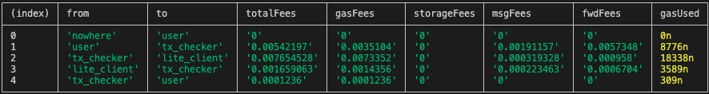

# trustless-bridge-contracts

## Project structure

- `contracts` - source code of all the smart contracts of the project and their dependencies.
- `wrappers` - wrapper classes (implementing `Contract` from ton-core) for the contracts, including any [de]serialization primitives and compilation functions.
- `tests` - tests for the contracts.
- `scripts` - scripts used by the project, mainly the deployment scripts.

## How to use

### Build

`npx blueprint build` or `yarn blueprint build`

### Test

`npx blueprint test` or `yarn blueprint test`

### Deploy or run another script

`npx blueprint run` or `yarn blueprint run`

### Add a new contract

`npx blueprint create ContractName` or `yarn blueprint create ContractName`

## Contract structure

### lite_client.fc

Storage:
`
[
    g::total_weight: uint64
    g::epoch_hash:  uint256
    g::validators: (Hashmap 256 uint64)
] = State;
`

### Operations:

`op:new_key_block#11a78ffe` - checks that the block corresponds to currently known epoch, that it is indeed a keyblock, it has valid signatures, loads new epoch parameters (validators), updates currently known epoch and messages back `ok#ff8ff4e1 query_id:uint64 block_hash:uint256 = InternalMsgBody;`.

```
new_key_block#11a78ffe 
query_id:uint64 
block:^ [
  file_hash:uint256
  block_proof:^Cell
]
signatures:^Cell
 = InternalMsgBody;
```
`op::check_block#8eaa9d76` check that the block corresponds to currently known epoch and correctly signed. If true send `correct#ce02b807 query_id:uint64 block_hash:uint256 = InternalMsgBody;` to the sender.

```
check_block#8eaa9d76
query_id:uint64 
block:^ [
  file_hash:uint256
  pruned_block:^Cell
]
signatures:^Cell
 = InternalMsgBody;
```


### Getters:
```
;; returns dictionary, which contains main validators
cell get_validators() method_id

;; returns contract storage
(cell, int, int) get_storage() method_id
```

### tx_checker.fc

### Operations:

`op::check_transaction#91d555f7` - checks proofs to confirm that a given transaction was committed in some masterchain block of the current epoch. If true send `transaction_checked#756adff1 transaction:^Cell = InternalMsgBody;` to the sender.
```
check_transaction#91d555f7 
  transaction:^[tx_hash:uint256 account_addr:uint256 tx_lt:uint64] 
  proof:^(MerkleProof Transaction) 
  current_block:^[ 
     block:^[file_hash:uint256 pruned_block:^Cell] 
     signatures:^Cell
  ] 
= InternalMsgBody;
```

## Gas Usage:
